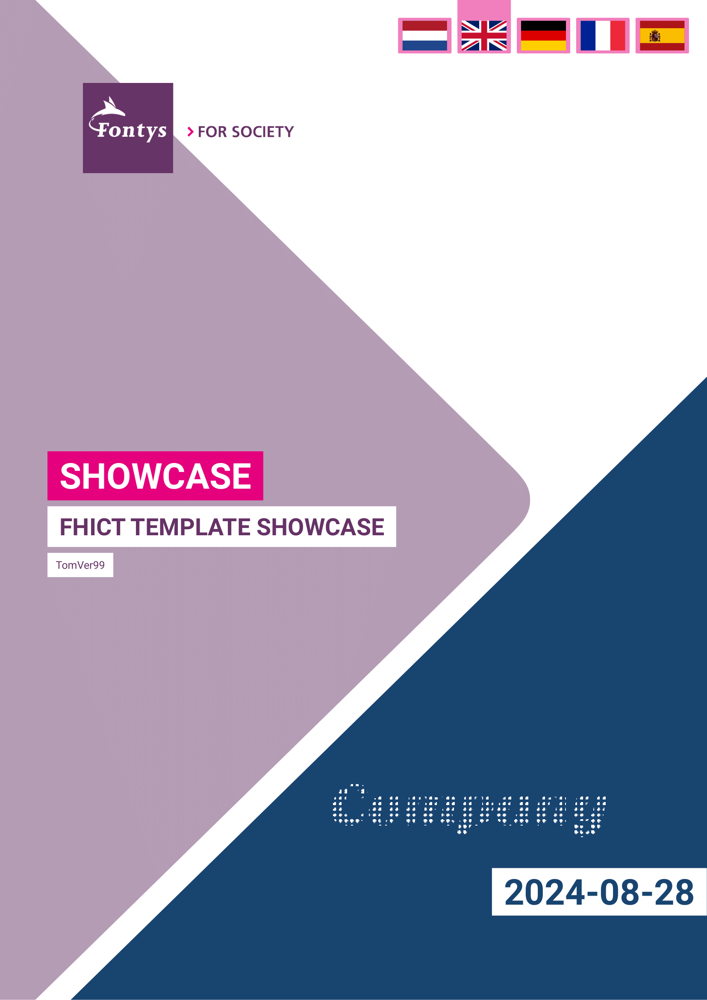

<!-- markdownlint-disable MD033 MD059 MD031 -->

# FHICT Typst Document Template

<!-- Project Status & Quality -->


<!-- Community & Activity -->


---

**Support this project:** If you find this template valuable, please consider leaving a star to help others discover it,\
or buy me a coffee to support its development!\
[](https://www.buymeacoffee.com/tomver)

---

This is a document template for creating professional-looking documents with Typst, tailored for FHICT (Fontys Hogeschool ICT), but it can also be used across other Fontys programs.\
It can also be found on the [Typst Universe](https://typst.app/universe/package/unofficial-fhict-document-template).

Looking for a template for Fontys themed research papers? Check out the [FHICT Research Paper Template](https://github.com/TomVer99/Fontys-paper-template).

## Introduction

Creating well-structured and visually appealing documents is crucial in academic and professional settings. This template is designed to help FHICT students and faculty produce professional looking documents.

<p>
  
  
</p>

## Why use this template (and Typst)?

### Typst

- **Easy to use**: Typst is a lightweight and easy-to-use document processor that allows you to write documents in a simple and structured way. You only need a browser or VSCode with just 1 extension to get started.
- **Fast**: Typst is fast and efficient, allowing you to focus on writing without distractions. It also gives you a live preview of your document.
- **Takes care of formatting**: Typst takes care of formatting your document, so you can focus on writing content.
- **High quality PDF output**: Typst produces high-quality PDF documents that are suitable for academic and professional settings.

### FHICT Document Template

- **Consistent formatting**: The template provides consistent formatting for titles, headings, subheadings, paragraphs, and all other elements.
- **Professional layout**: The template provides a clean and professional layout for your documents.
- **FHICT Style**: The template follows the FHICT style guide, making it suitable for FHICT students and faculty.
- **Configurable options**: The template provides configurable options for customizing the document to your needs.
- **Helper functions**: The template provides Helper functions for adding tables, hiding sensitive content, and more.
- **Multiple languages support**: The template can be set to multiple languages (nl, en, de, fr, es), allowing you to write documents in different languages.
- **Battle tested**: The template has been used without issue at FHICT, indicating its quality and reliability.

## Requirements

- **Roboto font** installed on your system.
- **Typst builder** installed. _You can use the [Typst CLI](https://typst.app/download/) or set up [VSCode with the Tinymist Typst Extension](https://marketplace.visualstudio.com/items?itemName=myriad-dreamin.tinymist)._

That’s it!  
Typst is OS-agnostic, so it works seamlessly on **Windows**, **macOS**, and **Linux**.

## Quick Start (5 minutes)

1. **Install Roboto font**: Download from [Google Fonts](https://fonts.google.com/specimen/Roboto) and install on your system
2. **Set up VSCode**: Install [Tinymist Typst Extension](https://marketplace.visualstudio.com/items?itemName=myriad-dreamin.tinymist)
3. **Create your first document**:
    ```typ
    #import "@preview/unofficial-fhict-document-template:1.2.1": *
    
    #show: fhict-doc.with(
      title: "My Document",
      authors: ((name: "your_name")),
      // ... other options
    )
    
    = Introduction
    Start writing your content here!
    ```

## Helpful Links / Resources

- The manual contains a list of all available options and helper functions. It can be found attached to the latest release.
- The [Typst Documentation](https://typst.app/docs/) is a great resource for learning how to use Typst.
- The bibliography file is written in [BibTeX](http://www.bibtex.org/Format/). You can use [BibTeX Editor](https://truben.no/latex/bibtex/) to easily create and edit your bibliography.
- You can use sub files to split your document into multiple files. This is especially useful for large documents.

## Contributing

I welcome contributions to improve and expand this document template. If you have ideas, suggestions, or encounter issues, please consider contributing by creating a pull request or issue.

### Adding a new language

Currently, the template includes support for the following languages: `Dutch` `(nl)`, `English` `(en)`, `German` `(de)`, `French` `(fr)`, and `Spanish` `(es)`. If you want to add a new language, you can do so by following these steps:

1. Add the language to the `language.yml` file in the `assets` folder. Copy the `en` section and replace the values with the new language.
2. Add a flag `XX-flag.svg` to the `assets` folder.
3. Update the README with the new language.
4. Create a pull request with the changes.

## Disclaimer

This template / repository is not endorsed by, directly affiliated with, maintained, authorized or sponsored by Fontys Hogeschool ICT. It is provided as-is, without any warranty or guarantee of any kind. Use at your own risk.

The author was/is a student at Fontys Hogeschool ICT and created this template for personal use. It is shared publicly in the hope that it will be useful to others.
